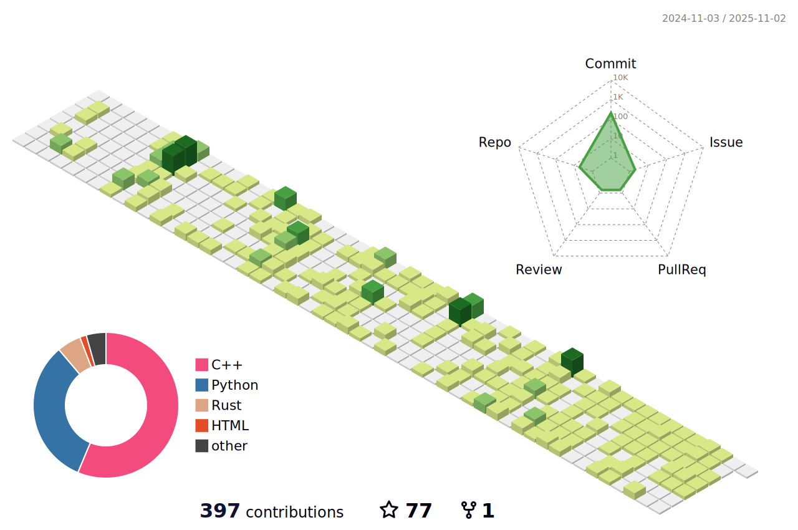

<h1 align="center">std::cout << "👋Greetings, traveler." << std::endl; </h1> 

<b>New turning points and stars that gleam,</b>
 

<b>Now fill the sky, unbound, supreme.</b>
 

<b>They are five thousand years of signs,</b>
 

<b>They are the gazing eyes of future minds.</b>

 

  
<!---->
<!---->

<picture>
  <source
    srcset="http://github-profile-summary-cards.vercel.app/api/cards/most-commit-language?username=ImQQiaoO&theme=nord_dark"
    media="(prefers-color-scheme: dark)"
  />
  <source
    srcset="http://github-profile-summary-cards.vercel.app/api/cards/most-commit-language?username=ImQQiaoO&theme=buefy"
    media="(prefers-color-scheme: light), (prefers-color-scheme: no-preference)"
  />
  
</picture>

<!---->
 
<!--

  
-->
<!--  -->

<!-- 

  

-->
 

<!--
**ImQQiaoO/ImQQiaoO** is a ✨ _special_ ✨ repository because its `README.md` (this file) appears on your GitHub profile.

Here are some ideas to get you started:

- 🔭 I’m currently working on ...
- 🌱 I’m currently learning ...
- 👯 I’m looking to collaborate on ...
- 🤔 I’m looking for help with ...
- 💬 Ask me about ...
- 📫 How to reach me: ...
- 😄 Pronouns: ...
- ⚡ Fun fact: ...
-->
